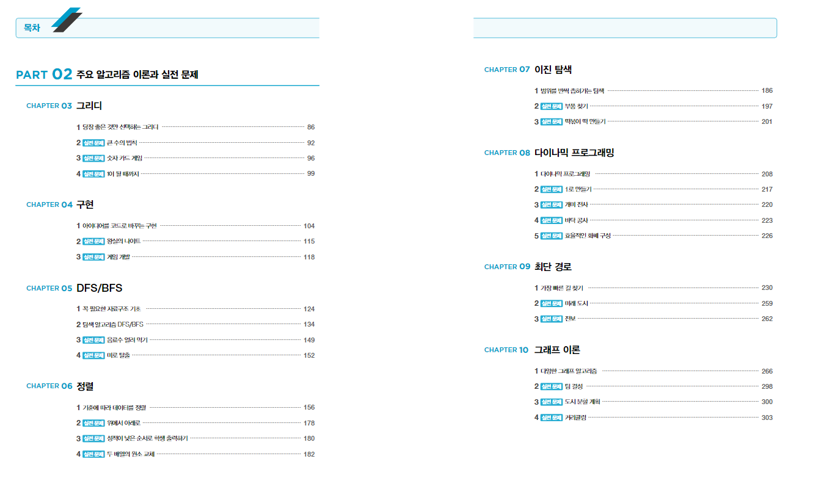
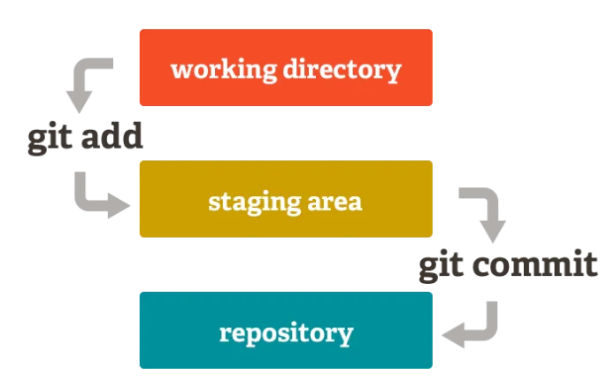
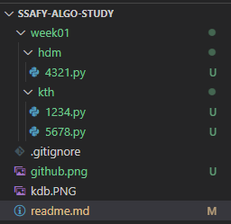

# 서울 1반 알고리즘 스터디 1조

## 진행 과정
- [x] 24.07.17 ~ 24.07.23 : 그리디
- [x] 24.07.24 ~ 24.07.30 : 구현
- [ ] 24.07.31 ~ 24.08.06 : DFS/BFS
- [ ] 24.08.07 ~ 24.08.13 : 정렬
- [ ] 24.08.14 ~ 24.08.20 : 이진 탐색
- [ ] 24.08.28 ~ 24.09.03 : 다이나믹 프로그래밍
- [ ] 24.09.04 ~ 24.09.10 : 최단 경로
- [ ] 24.09.11 ~ 24.09.17 : 그래프 이론

## 목표
역테 IM ~ A

## 기간
8주

## 서적
<이것이 취업을 위한 코딩테스트다>, 나동빈

## 모임 주기: 
한 주에 1회, 오프라인 (시간 미정)

## 진행 방식

- 과제
    - **이코테 1챕터 읽기**
    - **해당 챕터 기출 문제 하루에 한 문제씩 풀이 (월 ~ 금)**
        - 각 챕터 기출 위에서부터 5문제
    - **풀이한 문제 github 제출하기**
        - 하단 <깃허브 제출 방법> 참고
- 만나서
    - **각자 자신 있는 문제 1개씩 설명하기 & 피드백 주고 받기 (1시간 소요 예정)**
    - **+ 익숙해지면 코드 리뷰**

## 추가 학습 자료

- solved.ac 클래스 문제: https://solved.ac/class?class=1
- 유형별 추천 문제: https://github.com/tony9402/baekjoon/tree/main?tab=readme-ov-file

## 깃허브 제출 방법

1. 시작
    1. if 처음 프로젝트를 생성한다면, `git clone {github repo 주소}`
    2. else if 이미 작업 중이던 프로젝트라면, `git pull origin dev`

2. `git branch {나의 브랜치명}` # 브랜치 생성

3. `git checkout {나의 브랜치명}` # 생성한 브랜치로 이동

4. 작업 후 저장

5. `git add .`

6. `git commit -m "feat : {문제 제목 혹은 번호}"` 

7. `git push origin {나의 브랜치명 == 현재 작업 중인 브랜치명}`
    - 문제 생기면 팀원들에게 바로 공유!

8. Pull Request

    1. github 돌아가서 해당 레포 상단에 Pull Request 생성 (초록색 `Compare & pull request` 버튼): 
        1. 타겟 브랜치 설정: `{dev}` <- `{나의 브랜치명 == 방금 작업 완료한 브랜치명}`
        2. 상세 커밋 내용 작성 (자동 완성 사용해도 무방)
        3. 초록색 `Create pull request` 버튼 클릭

    2. github에서 Merge
        1. if 문제 없으면, `Merge pull request` -> `Confirm merge`
        2. else if 문제 있으면, Conflict 해결 -> `Merge pull request` -> `Confirm merge`

    3. Pull Request가 자동으로 생기지 않으면?
        - [git clone으로 협업하기](https://velog.io/@rkio/git-clone%EC%9C%BC%EB%A1%9C-%ED%98%91%EC%97%85%EC%9D%84-%ED%95%B4%EB%B3%B4%EC%9E%90)

9. 새로운 작업 시작

    1. `{나의 브랜치명}`에서 `git pull origin dev` (1-2번을 수행한 것과 동일)

    2. 새로운 주차 디렉토리 하위에 본인 디렉토리 생성

    3. 다시 2번으로 돌아가서 반복...

## 폴더 트리 구조 (참고)

